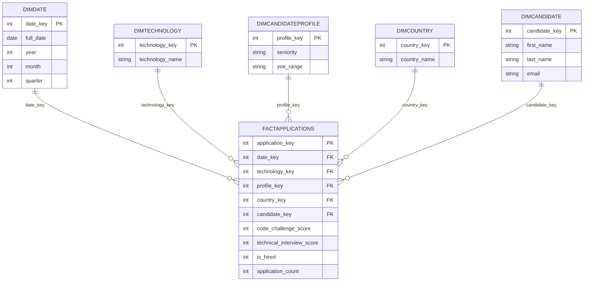

# ETL-Workshop-1
 
## Objetivo del Proyecto
 
Diseñar e implementar un Data Warehouse dimensional que permita a una empresa
de reclutamiento tecnológico analizar sus procesos de selección de candidatos
desde múltiples perspectivas (tiempo, tecnología, perfil, país, reaplicación),
siguiendo un flujo completo: Requisitos de Negocio -> Comprensión de Datos ->
Modelado Dimensional -> ETL -> Data Warehouse -> Analítica -> Decisiones de Negocio.
 
## Contexto de Negocio
 
Una empresa de reclutamiento tecnológico recibe miles de aplicaciones de
candidatos con distintos perfiles, niveles de experiencia, países y tecnologías.
Cada candidato es evaluado con dos pruebas técnicas (Code Challenge Score y
Technical Interview Score). Actualmente los datos existen solo como archivo
crudo; este proyecto construye el sistema analítico que permite entender
patrones de contratación y evaluar el desempeño del reclutamiento.
 
## Tecnologías Utilizadas
 
- Python (Pandas, SQLAlchemy)
- Jupyter Notebook (perfilamiento inicial de datos)
- SQL
- MySQL (Data Warehouse)
- Git y GitHub
## Instrucciones para Ejecutar el Proyecto
 
1. Clonar el repositorio.
2. Crear y activar un entorno virtual:
```
   python -m venv venv
   .\venv\Scripts\Activate.ps1
```
3. Instalar dependencias:
```
   pip install -r requirements.txt
```
4. Crear la base de datos y las tablas ejecutando `sql/create_tables.sql` en MySQL Workbench.
5. Ejecutar el pipeline completo:
```
   cd src
   python main.py
```
   (pedirá la contraseña de MySQL root al momento de cargar los datos)
 
## Descripción del Dataset
 
El dataset `candidates.csv` contiene información de aplicaciones de candidatos
a procesos de reclutamiento técnico. Cada fila representa una aplicación individual.
 
## Hallazgos del Perfilamiento (Data Profiling)
 
Perfilamiento realizado en `notebooks/data_profiling.ipynb`, en el siguiente orden:
 
**1. Forma del dataset (`df.shape`)**
- 50,000 filas × 10 columnas
**2. Tipos de datos (`df.dtypes`)**
- Texto (`str`): First Name, Last Name, Email, Application Date, Country, Seniority, Technology
- Numéricos (`int64`): YOE, Code Challenge Score, Technical Interview Score
- `Application Date` llega como texto, no como fecha — debe convertirse en la preparación de datos.
**3. Valores nulos (`df.isnull().sum()`)**
- 0 valores nulos en todas las columnas.
**4. Duplicados (`df.duplicated()`)**
- Filas duplicadas exactas: 0
- Emails duplicados: 167 (candidatos que aplicaron más de una vez)
**5. Rango de fechas (`Application Date`)**
- Mínima: 2018-01-01
- Máxima: 2022-07-04
**6. Valores únicos en categóricas**
- Seniority (7 valores): Intern, Trainee, Junior, Mid-Level, Senior, Lead, Architect
- Países: 244 valores distintos
- Tecnologías: 24 valores distintas
**7. Rango de los puntajes**
- Code Challenge Score: 0 a 10
- Technical Interview Score: 0 a 10
**8. Estadísticas descriptivas (`df.describe()`)**
 
| Variable | count | mean | std | min | 25% | 50% | 75% | max |
|---|---|---|---|---|---|---|---|---|
| YOE | 50000 | 15.29 | 8.83 | 0 | 8 | 15 | 23 | 30 |
| Code Challenge Score | 50000 | 5.00 | 3.17 | 0 | 2 | 5 | 8 | 10 |
| Technical Interview Score | 50000 | 5.00 | 3.17 | 0 | 2 | 5 | 8 | 10 |
 
### Decisiones derivadas del profiling
- No hay valores nulos que tratar.
- No hay filas duplicadas exactas.
- `Application Date` debe convertirse a tipo fecha (`datetime`) más adelante.
- Los 167 emails duplicados no son errores de carga (no son filas idénticas),
  sino candidatos que reaplicaron — se evaluará si sustentan un requisito adicional (R4/R5).
## Requisitos de Negocio Adicionales (R4, R5)
 
| ID | Requisito de Negocio | Pregunta de Negocio | Decisión que Soporta |
|----|----------------------|----------------------|------------------------|
| R4 | Analizar el país de origen de las aplicaciones y su tasa de contratación desglosada por nivel de seniority. | ¿Qué países de origen tienen mayor volumen de aplicaciones y mejor tasa de contratación para cada nivel de seniority? | Priorizar en qué países enfocar campañas de reclutamiento dirigidas a perfiles específicos. |
| R5 | Analizar si los candidatos que aplican más de una vez tienen una tasa de contratación distinta a los que aplican una sola vez. | ¿Los candidatos que reaplican tienen mayor o menor tasa de contratación que los que aplican una sola vez? | Decidir si vale la pena animar a los candidatos no contratados a volver a aplicar. |
 
## Trazabilidad de Requisitos
 
| Requisito | Pregunta de Negocio | Datos Requeridos | Salida Analítica Esperada |
|---|---|---|---|
| R1 | Monitorear las tendencias de contratación a lo largo del tiempo para identificar cambios en los resultados de reclutamiento. | Application Date, Code Challenge Score, Technical Interview Score | Tabla agrupada por mes: total de aplicaciones, total de contratados, tasa de contratación. |
| R2 | Comparar los resultados de contratación entre tecnologías para identificar qué perfiles técnicos generan el mayor número y proporción de candidatos contratados. | Technology, Code Challenge Score, Technical Interview Score | Tabla agrupada por Technology: total de aplicaciones, total de contratados, tasa de contratación. |
| R3 | Analizar los resultados de contratación según el seniority del candidato y los años de experiencia profesional. | Seniority, YOE, Code Challenge Score, Technical Interview Score | Tabla agrupada por Seniority y rango de YOE: total de aplicaciones, total de contratados, tasa de contratación. |
| R4 | Analizar el país de origen de las aplicaciones y su tasa de contratación desglosada por nivel de seniority. | Country, Seniority, Code Challenge Score, Technical Interview Score | Tabla agrupada por Country y Seniority: total de aplicaciones, total de contratados, tasa de contratación. |
| R5 | Analizar si los candidatos que aplican más de una vez tienen una tasa de contratación distinta a los que aplican una sola vez. | Email, Code Challenge Score, Technical Interview Score | Tabla agrupada por "reaplicó: sí/no": total de candidatos, total de contratados, tasa de contratación. |
 
## Modelo Dimensional
 
### Proceso de Negocio
Proceso de Aplicación de Candidatos (Candidate Application Process). Cada fila del
dataset representa una aplicación individual de un candidato a un proceso de
reclutamiento técnico — este es el evento central sobre el cual giran los 5
requisitos de negocio (R1-R5).
 
### Grano
Una fila en la Tabla de Hechos (FactApplications) representa una aplicación
individual de un candidato a un proceso de reclutamiento, en una fecha específica,
para una tecnología específica.
 
### Dimensiones
 
| Dimensión | Propósito | Atributos Principales | Requisito(s) que Soporta |
|---|---|---|---|
| DimDate | Contextualizar el tiempo de cada aplicación | full_date, year, month, quarter | R1 |
| DimTechnology | Contextualizar la tecnología a la que aplicó | technology_name | R2 |
| DimCandidateProfile | Contextualizar el perfil (seniority + experiencia) | seniority, yoe_range | R3 |
| DimCountry | Contextualizar el país de origen | country_name | R4 |
| DimCandidate | Identificar al candidato (para detectar reaplicaciones) | first_name, last_name, email | R5 |
 
### Hechos y Medidas
 
| Medida | Significado | Fuente / Cálculo | Requisito(s) que Soporta |
|---|---|---|---|
| code_challenge_score | Puntaje del reto de código (0-10) | Directo del CSV | Todos (para calcular is_hired) |
| technical_interview_score | Puntaje de la entrevista técnica (0-10) | Directo del CSV | Todos (para calcular is_hired) |
| is_hired | 1 si fue contratado, 0 si no | Calculado: 1 si code_challenge_score >= 7 Y technical_interview_score >= 7, si no 0 | R1, R2, R3, R4, R5 |
| application_count | Cuenta de aplicaciones (siempre 1 por fila) | Constante = 1 | Todos |
 
### Esquema Estrella
 
**Tabla de Hechos: FactApplications**
- application_key (PK, surrogate)
- date_key (FK -> DimDate)
- technology_key (FK -> DimTechnology)
- profile_key (FK -> DimCandidateProfile)
- country_key (FK -> DimCountry)
- candidate_key (FK -> DimCandidate)
- code_challenge_score (medida)
- technical_interview_score (medida)
- is_hired (medida)
- application_count (medida)
### Esquema Estrella (Diagrama)
 

 
Cada dimensión se conecta a la Tabla de Hechos mediante su llave subrogada (FK).
Cada dimensión usa una llave subrogada como llave primaria (no se usan llaves
naturales del CSV como PK).
 
### Validación del Modelo
 
| Requisito | Dimensión(es) Requerida(s) | Medida(s) Requerida(s) | Soportado? |
|---|---|---|---|
| R1 | DimDate | is_hired, application_count | Si |
| R2 | DimTechnology | is_hired, application_count | Si |
| R3 | DimCandidateProfile | is_hired, application_count | Si |
| R4 | DimCountry, DimCandidateProfile | is_hired, application_count | Si |
| R5 | DimCandidate | is_hired, application_count | Si |
 
## Proceso ETL (Task 3 y Task 4)
 
### Extract (src/extract.py)
 
Función `extract_data(filepath)`: lee `candidates.csv` con `pandas.read_csv()`,
usando `sep=';'` (el archivo usa punto y coma como separador, no coma). No se
realiza ninguna transformación en esta etapa — solo lectura del archivo crudo.
 
### Data Preparation (src/transform.py - prepare_data)
 
Función `prepare_data(df)`: convierte la columna `Application Date` de texto
(`str`) a tipo fecha real (`datetime`) usando `pd.to_datetime()`. Esta conversión
es necesaria para poder extraer año, mes y trimestre en `DimDate` más adelante.
No se trataron valores nulos ni duplicados porque el profiling confirmó que no
existen en el dataset.
 
### Business Transformation (src/transform.py - apply_business_rules)
 
Función `apply_business_rules(df)`: crea la columna `is_hired` aplicando la
regla de negocio de la sección 5.1 del taller:
 
    is_hired = 1 si (Code Challenge Score >= 7) Y (Technical Interview Score >= 7)
    is_hired = 0 en caso contrario
 
Resultado obtenido: 6,698 de 50,000 candidatos contratados (13.4% de tasa de
contratación general). Este porcentaje sirve como línea base para comparar
contra las tasas de contratación segmentadas por tecnología, país, seniority, etc.
 
### Transformación Dimensional (src/dimensional_model.py)
 
Se implementaron 6 funciones, una por cada tabla del esquema estrella:
 
- `create_dim_date(df)`: extrae fechas únicas de `Application Date`, genera
  `date_key` como llave subrogada secuencial, y deriva `year`, `month`, `quarter`
  con los accesores `.dt` de Pandas. Resultado: 1,646 fechas únicas.
- `create_dim_technology(df)`: extrae valores únicos de `Technology`, genera
  `technology_key`. Resultado: 24 tecnologías únicas.
- `create_dim_candidate_profile(df)`: convierte `YOE` (numérico, 0-30) en rangos
  categóricos de 5 años (`0-5`, `6-10`, ..., `26-30`) usando `pd.cut()`, y combina
  cada rango con `Seniority` para formar un perfil único. Resultado: 42 perfiles
  únicos (7 seniorities x 6 rangos de YOE).
- `create_dim_country(df)`: extrae países únicos de `Country`, genera
  `country_key`. Resultado: 244 países únicos.
- `create_dim_candidate(df)`: identifica candidatos únicos por `Email` (usando
  `drop_duplicates(subset=['Email'])`), para que cada persona real tenga un solo
  `candidate_key`, aunque haya aplicado varias veces. Resultado: 49,833 candidatos
  únicos (50,000 aplicaciones - 167 emails duplicados).
- `create_fact_applications(...)`: mapea cada una de las 50,000 aplicaciones a
  las llaves subrogadas de las 5 dimensiones, usando `merge()` (equivalente a un
  JOIN de SQL) entre el DataFrame transformado y cada tabla de dimensión. Se
  validó que las 50,000 filas obtuvieron una llave válida en las 5 dimensiones
  (0 referencias nulas/inválidas).


## Creación del Esquema en MySQL (Task 5)

Antes de cargar datos, se creó la base de datos y las 6 tablas directamente en
MySQL Workbench, y el script se guardó en `sql/create_tables.sql` para que el
esquema sea reproducible por cualquier persona que clone el repositorio.

### Pasos seguidos

1. Creación de la base de datos:
```sql
   CREATE DATABASE recruitment_dw;
   USE recruitment_dw;
```

2. Creación de las 5 tablas de dimensión, cada una con su llave subrogada como
   llave primaria (`PRIMARY KEY`):
```sql
   CREATE TABLE DimDate (
       date_key INT PRIMARY KEY,
       full_date DATE NOT NULL,
       year INT NOT NULL,
       month INT NOT NULL,
       quarter INT NOT NULL
   );

   CREATE TABLE DimTechnology (
       technology_key INT PRIMARY KEY,
       technology_name VARCHAR(100) NOT NULL
   );

   CREATE TABLE DimCandidateProfile (
       profile_key INT PRIMARY KEY,
       seniority VARCHAR(50) NOT NULL,
       yoe_range VARCHAR(20) NOT NULL
   );

   CREATE TABLE DimCountry (
       country_key INT PRIMARY KEY,
       country_name VARCHAR(100) NOT NULL
   );

   CREATE TABLE DimCandidate (
       candidate_key INT PRIMARY KEY,
       first_name VARCHAR(100) NOT NULL,
       last_name VARCHAR(100) NOT NULL,
       email VARCHAR(150) NOT NULL
   );
```

3. Creación de la Tabla de Hechos, con llaves foráneas (`FOREIGN KEY`) apuntando
   a cada dimensión — esto garantiza integridad referencial (MySQL rechaza
   cualquier fila cuyo valor de llave no exista en la dimensión referenciada):
```sql
   CREATE TABLE FactApplications (
       application_key INT PRIMARY KEY,
       date_key INT NOT NULL,
       technology_key INT NOT NULL,
       profile_key INT NOT NULL,
       country_key INT NOT NULL,
       candidate_key INT NOT NULL,
       code_challenge_score INT NOT NULL,
       technical_interview_score INT NOT NULL,
       is_hired INT NOT NULL,
       application_count INT NOT NULL,
       FOREIGN KEY (date_key) REFERENCES DimDate(date_key),
       FOREIGN KEY (technology_key) REFERENCES DimTechnology(technology_key),
       FOREIGN KEY (profile_key) REFERENCES DimCandidateProfile(profile_key),
       FOREIGN KEY (country_key) REFERENCES DimCountry(country_key),
       FOREIGN KEY (candidate_key) REFERENCES DimCandidate(candidate_key)
   );
```

### Por qué este orden importa

Las dimensiones se crean **antes** que `FactApplications`, porque las cláusulas
`FOREIGN KEY ... REFERENCES` necesitan que la tabla referenciada ya exista. El
mismo orden se respeta al vaciar las tablas (`clear_tables` en `src/load.py`):
primero `FactApplications` (la que depende de las demás), luego las 5 dimensiones.


## Carga del Data Warehouse (Task 5)
 
Base de datos `recruitment_dw` creada en MySQL con las 6 tablas del esquema
estrella (definidas en `sql/create_tables.sql`), con llaves foráneas para
integridad referencial.
 
Carga realizada desde Python (`src/load.py` + `src/main.py`) usando SQLAlchemy.
`main.py` es el punto de entrada único del pipeline completo: Extract -> Prepare
-> Business Rules -> Dimensional Model -> Load. Antes de cargar, se vacían las
tablas (`clear_tables`) para permitir re-ejecuciones sin duplicar datos.
 
### Registros cargados
 
| Tabla | Registros |
|---|---|
| DimDate | 1,646 |
| DimTechnology | 24 |
| DimCandidateProfile | 42 |
| DimCountry | 244 |
| DimCandidate | 49,833 |
| FactApplications | 50,000 |
 
Se verificó que las 50,000 aplicaciones tienen referencias válidas hacia las
5 dimensiones (0 llaves nulas).


## Consultas Analíticas y KPIs (Task 6)

Todas las consultas se ejecutaron directamente sobre el Data Warehouse
(`recruitment_dw` en MySQL), no sobre el CSV ni sobre DataFrames intermedios.
El archivo completo de consultas está en `sql/analytical_queries.sql`.

### R1 — Tendencias de Contratación en el Tiempo

**Pregunta de negocio:** ¿Cómo varía la tasa de contratación mes a mes?

**Consulta SQL:**
```sql
SELECT
    d.year,
    d.month,
    SUM(f.application_count) AS total_aplicaciones,
    SUM(f.is_hired) AS total_contratados,
    ROUND(SUM(f.is_hired) / SUM(f.application_count) * 100, 2) AS tasa_contratacion_pct
FROM FactApplications f
JOIN DimDate d ON f.date_key = d.date_key
GROUP BY d.year, d.month
ORDER BY d.year, d.month;
```

**Resultado (muestra):**

| Año | Mes | Aplicaciones | Contratados | Tasa % |
|---|---|---|---|---|
| 2018 | 1 | 922 | 112 | 12.15 |
| 2019 | 8 | 955 | 148 | 15.50 |
| 2020 | 1 | 916 | 127 | 13.86 |
| 2021 | 1 | 909 | 143 | 15.73 |
| 2022 | 5 | 979 | 144 | 14.71 |

**Interpretación:** La tasa de contratación se mantiene estable a lo largo de los
4.5 años del dataset, moviéndose entre 11.4% y 16.96%, sin una tendencia sostenida
de subida o bajada. Julio de 2022 muestra solo 112 aplicaciones (muy por debajo
del promedio mensual de ~900-990) porque el dataset termina el 2022-07-04, es
decir, ese mes está incompleto y no representa una caída real de actividad.

### R2 — Comparación de Tecnologías

**Pregunta de negocio:** ¿Qué tecnologías generan mayor número y proporción de
candidatos contratados?

**Consulta SQL:**
```sql
SELECT
    t.technology_name,
    SUM(f.application_count) AS total_aplicaciones,
    SUM(f.is_hired) AS total_contratados,
    ROUND(SUM(f.is_hired) / SUM(f.application_count) * 100, 2) AS tasa_contratacion_pct
FROM FactApplications f
JOIN DimTechnology t ON f.technology_key = t.technology_key
GROUP BY t.technology_name
ORDER BY tasa_contratacion_pct DESC;
```

**Resultado (top y bottom):**

| Tecnología | Aplicaciones | Contratados | Tasa % |
|---|---|---|---|
| Development - CMS Backend | 1,882 | 284 | 15.09 |
| Database Administration | 1,933 | 282 | 14.59 |
| System Administration | 2,014 | 293 | 14.55 |
| ... | ... | ... | ... |
| Technical Writing | 1,901 | 223 | 11.73 |
| Social Media Community Management | 2,028 | 237 | 11.69 |

**Interpretación:** Development - CMS Backend tiene la mejor tasa de contratación
(15.09%). DevOps y Game Development destacan por volumen (~3,800 aplicaciones
cada una, el doble que el resto de tecnologías), aunque sus tasas de contratación
(13.00% y 13.59%) están en el promedio general, no en los extremos. Social Media
Community Management y Technical Writing muestran las tasas más bajas (~11.7%).

### R3 — Perfil del Candidato (Seniority + Años de Experiencia)

**Pregunta de negocio:** ¿Existen diferencias en la tasa de contratación según
el seniority y los años de experiencia del candidato?

**Consulta SQL:**
```sql
SELECT
    p.seniority,
    p.yoe_range,
    SUM(f.application_count) AS total_aplicaciones,
    SUM(f.is_hired) AS total_contratados,
    ROUND(SUM(f.is_hired) / SUM(f.application_count) * 100, 2) AS tasa_contratacion_pct
FROM FactApplications f
JOIN DimCandidateProfile p ON f.profile_key = p.profile_key
GROUP BY p.seniority, p.yoe_range
ORDER BY p.seniority, p.yoe_range;
```

**Resultado (muestra):**

| Seniority | Rango YOE | Aplicaciones | Contratados | Tasa % |
|---|---|---|---|---|
| Intern | 0-5 | 1,281 | 198 | 15.46 |
| Mid-Level | 0-5 | 1,351 | 153 | 11.32 |
| Senior | 16-20 | 1,146 | 132 | 11.52 |
| Trainee | 0-5 | 1,356 | 191 | 14.09 |

**Interpretación:** Las tasas de contratación se mueven en un rango angosto
(11.32% a 15.46%) sin un patrón claro asociado al seniority o a los años de
experiencia — por ejemplo, Intern con 0-5 años (15.46%) supera a Mid-Level con
0-5 años (11.32%). Esto sugiere que el resultado de contratación depende
principalmente de los puntajes de las pruebas técnicas, no del perfil declarado
del candidato.

### R4 — País de Origen

**Pregunta de negocio:** ¿Qué países tienen mayor volumen de aplicaciones y cuál
es su tasa de contratación?

**Consulta SQL:**
```sql
SELECT
    c.country_name,
    SUM(f.application_count) AS total_aplicaciones,
    SUM(f.is_hired) AS total_contratados,
    ROUND(SUM(f.is_hired) / SUM(f.application_count) * 100, 2) AS tasa_contratacion_pct
FROM FactApplications f
JOIN DimCountry c ON f.country_key = c.country_key
GROUP BY c.country_name
ORDER BY total_aplicaciones DESC
LIMIT 10;
```

**Resultado (Top 10 por volumen):**

| País | Aplicaciones | Contratados | Tasa % |
|---|---|---|---|
| Malawi | 242 | 23 | 9.50 |
| Spain | 238 | 31 | 13.03 |
| Malaysia | 232 | 34 | 14.66 |
| Nauru | 231 | 33 | 14.29 |
| Tajikistan | 233 | 23 | 9.87 |

**Interpretación:** Malawi recibe el mayor volumen de aplicaciones (242), pero
tiene una de las tasas de contratación más bajas del top 10 (9.50%), muy por
debajo del promedio general (13.4%). Malaysia y Nauru, en cambio, combinan buen
volumen con las mejores tasas de contratación (14.66% y 14.29%). Esto sugiere
priorizar campañas de reclutamiento en países como Malaysia o Nauru, que
convierten mejor, en vez de solo enfocarse en el volumen bruto de aplicaciones.

### R5 — Efecto de la Reaplicación

**Pregunta de negocio:** ¿Los candidatos que reaplican tienen una tasa de
contratación distinta a los que aplican una sola vez?

**Consulta SQL:**
```sql
SELECT
    CASE
        WHEN app_count_per_candidate > 1 THEN 'Reaplicó'
        ELSE 'Aplicó una sola vez'
    END AS grupo,
    COUNT(DISTINCT candidate_key) AS total_candidatos,
    SUM(is_hired) AS total_contratados_aplicaciones,
    ROUND(SUM(is_hired) / COUNT(*) * 100, 2) AS tasa_contratacion_pct
FROM (
    SELECT
        f.candidate_key,
        f.is_hired,
        COUNT(*) OVER (PARTITION BY f.candidate_key) AS app_count_per_candidate
    FROM FactApplications f
) sub
GROUP BY grupo;
```

**Resultado:**

| Grupo | Candidatos únicos | Contratados | Tasa % |
|---|---|---|---|
| Aplicó una sola vez | 49,668 | 6,661 | 13.41 |
| Reaplicó | 165 | 37 | 11.14 |

**Interpretación:** Los candidatos que reaplicaron muestran una tasa de
contratación ligeramente menor (11.14%) que quienes aplicaron una sola vez
(13.41%), una diferencia de 2.3 puntos porcentuales. No hay evidencia de que
reaplicar mejore las posibilidades de contratación; de hecho, sugiere
ligeramente lo contrario. Es importante notar que la muestra de reaplicantes
es pequeña (165 candidatos frente a 49,668), por lo que esta diferencia podría
no ser estadísticamente significativa y debe interpretarse con cautela.